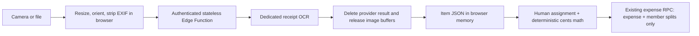

# Feasibility Report: Receipt Capture and Item-Based Splitting

**Product:** Parité
**Date:** 29 August 2026
**Decision:** Proceed with a stateless, OCR-assisted, human-reviewed MVP. Do not retain receipt images or use AI for person assignment or arithmetic.

## Executive decision

Parité can feasibly let a payer photograph or upload a receipt, extract the merchant, date, currency, totals, and named line items, then calculate each member's share after the user assigns those items. The leanest implementation does not upload the image to Supabase Storage or save it in Postgres: it passes compressed bytes through an authenticated stateless function to a dedicated receipt parser, returns normalized JSON, and discards the bytes.

The hard boundary is ownership: a receipt can show `Chicken Burger` and `Latte`, but normally contains no evidence of which trip member consumed them. The safe product should automate transcription and arithmetic, while requiring a person to confirm item ownership before an expense is created.

| Capability | Feasibility | Decision |
| --- | --- | --- |
| Capture or upload one receipt image | High | Include in MVP |
| Extract item names, prices, totals, and common adjustments | Medium-high with review | Include with editable results |
| Divide assigned items and reconcile cents | High | Use deterministic code, not AI |
| Infer which member consumed each item | Low without extra evidence | Keep as explicit user assignment |
| Process without retaining the image in Parité's backend | High | Keep only transiently in browser/function memory |
| Save an expense without reviewing extracted values | Technically possible, financially unsafe | Do not implement |
| Use a Workspace Agent as the production OCR engine | Low | Use only for optional internal exception review |

**Overall feasibility:** high for an OCR-assisted flow; medium for extraction accuracy across all receipt qualities and languages; low for a fully hands-off splitter.

## Why it fits Parité

Parité already has most of the financial foundation:

- The add-expense experience is a mobile-first, full-screen `basic -> preview` flow in `src/components/ExpensesTab.tsx:144-170`.
- Expenses already accept exact per-member totals through `ExpenseSplitInput` in `src/types.ts:69-83`.
- Cent-aware equal and custom splitting already validates exact totals in `src/lib/calculations.ts:15-225`.
- Expense persistence is centralized in `src/lib/tripRepository.ts:536-605` and the database validates membership, payer access, conversion, and split totals atomically.
- The existing balances do not need to change: item assignments can be aggregated into the same one-total-per-member split format.

The missing pieces for the lean MVP are browser capture/preprocessing, secure stateless extraction, transient line-item state, assignment UI, and reconciliation. No database migration is required if Parité saves only the final aggregate expense and member splits. The tradeoff is intentional: after saving, users cannot reopen the receipt or reconstruct its item assignments.

`ExpensesTab.tsx` is already more than 2,000 lines. Receipt import should be implemented as separate components and state rather than added directly to the existing form body.

## Recommended product flow

1. **Choose an entry path.** Keep manual entry unchanged and add a prominent **Scan receipt** action at the top of the current Add Expense screen.
2. **Capture or upload.** On mobile, open the rear camera; on desktop, offer a file picker. Show brief guidance to capture the whole receipt without glare.
3. **Process once.** Resize, orient, and strip metadata in the browser, then send the image bytes directly to an authenticated extraction endpoint. Show a cancellable `Reading receipt` state. Do not create a storage object or processing draft.
4. **Check the receipt.** Show the image beside editable merchant/title, date, currency, subtotal, tax, tip, fees, discounts, total, and individual lines. Mark questionable fields with text such as **Needs check**, not color alone.
5. **Assign items.** Every charged line starts unassigned. The user assigns one or more member avatar chips; multiple members split a line equally in the MVP. Shortcuts should include **Payer**, **Everyone**, and **Assign all**.
6. **Allocate extras.** Default order-level tax, tip, service charges, and discounts proportionally to each member's assigned item subtotal. Also offer equal and manual allocation.
7. **Reconcile.** Block saving until receipt total, extracted items plus adjustments, and member totals agree. Provide actions to edit a line, add an adjustment, or fall back to the existing manual split.
8. **Confirm and save.** Show each person's share in receipt and trip-base currency, payer, date, rate, and any one-cent rounding distribution. Save only the normal expense and aggregate member splits.
9. **Discard transient data.** Revoke the browser preview URL and clear the image, raw OCR, and item-assignment state after save, cancel, or navigation.

The current amount-first visual language—large cards, sage/blue accents, and a sticky mobile action bar—can be retained. Receipt capture is a sibling route into the same final preview, not a replacement for manual entry.

## Recommended technical architecture

### Server boundary

Use a **Supabase Edge Function** for the first implementation. Parité already uses Supabase Auth, while the checked-in Cloudflare configuration currently serves SPA assets without a Worker entry or secret bindings. The function is a thin security and normalization boundary, not an image-processing server.

The function should:

1. Verify the signed-in user and approved trip membership.
2. Enforce MIME, byte-size, decoded-dimension, and one-image limits.
3. Accept multipart binary bytes; do not use Base64, which adds roughly one-third transfer overhead.
4. Forward the bytes to a purpose-built receipt parser without writing a file or logging the request body.
5. Normalize the result to a small schema of merchant, date, currency, totals, adjustments, and line items.
6. Delete the provider-side analysis result immediately when the provider exposes deletion, then release all buffers.
7. Return JSON directly to the browser. Do not cache or persist the image, raw OCR, or normalized result.

Never place an Azure, AWS, Google, OpenAI, or Supabase service-role secret in `VITE_*` variables or frontend code.

### Persistence decision

| Data | Lean MVP behavior |
| --- | --- |
| Original image | Browser memory until extraction/review ends; never saved by Parité |
| Edge Function image bytes | Request memory only; released after the provider response |
| Raw OCR and confidence geometry | Normalize what the UI needs, then discard |
| Item list and assignments | Browser state only until the expense is saved |
| Final totals per member | Save through the existing expense and split RPCs |

This avoids Storage, new receipt tables, draft cleanup jobs, signed URLs, and changes to the workspace payload. If users later need to reopen or audit item assignments, add **text-only** receipt/item records as a separate phase; retaining an image is still unnecessary.

## Financial rules

AI should only extract candidates. All financial behavior should be deterministic:

- Perform calculations in receipt-currency minor units or exact PostgreSQL numerics; never trust floating-point OCR values directly.
- Treat the printed line total as authoritative when `quantity × unit price` differs, and flag the mismatch.
- Keep repeated item names as separate rows.
- Divide shared lines by explicit weights or equally, allocating remainder cents deterministically.
- Allocate receipt-level tax, tip, fees, and discounts using the selected policy.
- Aggregate each member's original-currency share before conversion.
- Convert the receipt and member totals to trip-base currency, then distribute any conversion remainder so member splits exactly equal `converted_amount`.
- Preserve the original printed item text even if a normalized label is displayed.

The current top-level service-fee model is percentage-based. Real receipts contain fixed tax, handwritten tips, several fee lines, and negative discounts. In the stateless MVP, show these as transient adjustment rows during review and allocate each proportionally, equally, or manually. Save the printed grand total as a normal expense with `fee_percent = 0`, and save the calculated member amounts as the existing custom split. Use the existing percentage fee field only when the user deliberately enters a percentage outside the already-inclusive printed total; otherwise it would double-count the receipt fee.

Parité currently accepts AED, CNY, KZT, and USD only. An unsupported or ambiguous detected currency must require manual correction.

## Extraction options

| Option | Strengths | Risks / fit | Recommendation |
| --- | --- | --- | --- |
| **Azure Document Intelligence `prebuilt-receipt`** | Dedicated receipt fields and line items; broad documented language coverage including Arabic, Kazakh, and Russian; exposes an early-delete API | Async polling; input and results otherwise remain temporarily available for up to 24 hours | **Best likely language fit; delete the analysis result immediately** |
| **AWS Textract AnalyzeExpense** | Synchronous one-page byte request; dedicated summary fields and line items; inexpensive official example pricing | Narrower documented OCR language coverage; review AWS AI-service data-use controls | **Lowest-complexity choice for English/Latin receipts** |
| **Google Document AI Expense Parser** | Online processing is documented as in-memory and not persisted to disk; structured expense entities | Narrower documented language set for Parité; relatively high one-receipt price | **Strongest documented no-disk choice if its languages fit** |
| **Browser-only OCR such as Tesseract.js** | No Parité server or third-party image upload | Large WASM/language downloads, high mobile CPU/RAM/battery use, and weaker receipt structure extraction | Do not use as the default merely to save server work |
| **OpenAI image model** | Flexible layouts and multilingual fallback; schema-constrained JSON is possible | Uses image tokens, is less deterministic than dedicated receipt OCR, and has separate content-retention controls | Use only as a fallback after benchmark evidence |
| **Self-hosted OCR** | Full infrastructure control | Highest Parité CPU/RAM, scaling, maintenance, and abuse burden | Avoid for the MVP |

A one-page receipt does not require a "hardcore" model or millions of tokens. A dedicated receipt API performs OCR and field extraction; Parité's server only authenticates, forwards a compressed image, validates a small JSON response, and releases memory. An image-capable language model is optional, not part of the default path.

Provider processing must be described precisely. "Not saved on the backend" can mean Parité never persists the image, but the bytes still exist transiently in browser, network, function, and provider memory. Google documents no-disk online processing. Azure documents temporary storage but provides a v4.0 delete-result endpoint. The selected provider's current contract, region, logging, and data-use terms must match the product promise.

### Compute and operational burden

| Approach | Parité server burden | User-device burden | External compute/cost | Verdict |
| --- | --- | --- | --- | --- |
| Stateless function + dedicated receipt OCR | Very low | Low preprocessing only | Low to moderate, usually per page | **Best overall balance** |
| Browser-only OCR | Near zero | High CPU, RAM, battery, and model download | None | Useful only as an optional offline mode |
| Stateless function + image language model | Very low | Low | Higher and less predictable token work | Fallback, not default |
| Self-hosted OCR | High CPU/RAM and scaling | Low | Infrastructure cost | Avoid |

The key optimization is to keep Parité out of the expensive path. The browser performs one resize; the function streams or forwards bytes and handles a small JSON response; the specialized provider does extraction; the browser performs all item assignment and integer-cent arithmetic. No queue, database draft, image transformation server, or AI reasoning loop is needed.

### Free-tier guardrails (30 August 2026)

Azure currently documents 500 free pages per month for Document Intelligence F0. Because this MVP accepts one
single-image receipt per extraction, Parité can reserve up to 450 app-initiated attempts per UTC month and leave
50 pages of headroom for validation, retries, or calls outside the normal UI. Each approved user receives up to
10 attempts per UTC month, so shared capacity is equivalent to 45 full personal allowances. An attempt counts
once it passes authentication, image validation, membership, and configuration
checks and is about to call Azure; ambiguous provider failures are not refunded.

The durable quota data is not receipt data. It contains only a user ID, UTC month, and count. The
browser can read only its own count and whether shared capacity is available; it cannot read the global count or
reserve quota directly. These controls protect the app's free allowance, but they do not change Azure's pricing
or guarantee that every image is free if the resource is used elsewhere or Azure changes its terms.

F0 also currently documents one Analyze request per second and one result GET request per second for the whole
resource. A 1,100 ms polling floor keeps one extraction job below the result-GET rate, but concurrent stateless
requests can still collide. Resource-wide concurrency and 429 handling remain a live rollout test rather than a
claim that the monthly counters alone make F0 throughput-safe.

The monthly counters protect provider attempts rather than all Edge traffic. The normal browser checks status
before selecting an image, but a custom client could repeatedly submit invalid or unauthorized request bodies
that never reach reservation. A gateway-level per-user request limit remains a production rollout requirement
to bound that bandwidth and memory burden without counting a user's malformed photo as an Azure attempt.

### Workspace Agents

Workspace Agents are not suitable as the core extraction path today:

- The trigger accepts a required text `input` and optional `conversation_key`; it has no image/file field.
- It returns an accepted conversation link and can optionally expose run status, but the agent's answer cannot currently be retrieved through the API.
- Passing a signed receipt URL as text would require a separate fetch tool and a separate write-back integration.

A Workspace Agent could later review failed imports or open an internal exception conversation. It should not sit between a user tapping Save and Parité receiving machine-readable financial data.

## Security, privacy, and abuse controls

- Do not create a Supabase Storage object, database blob, temporary disk file, queue payload, cache entry, or image log.
- Keep the local preview in a revocable browser `Blob` URL and clear it after save, cancel, navigation, or error.
- Resize the long edge to roughly 1,600–2,000 pixels, target about 1–3 MB, correct orientation, and strip EXIF/GPS in the browser. Preserve enough resolution for small thermal-print text.
- Send binary multipart data rather than Base64. Validate decoded MIME type, byte size, dimensions, and one-image scope; do not accept SVG.
- Configure logs and error reporting to exclude request bodies, raw OCR, card fragments, loyalty IDs, addresses, and other receipt content.
- Delete the provider's analysis result immediately when supported, and document any unavoidable provider-side transient retention.
- Rate-limit extraction and add per-account quotas because provider calls are a paid abuse surface.
- Keep the provider's own account quota and alerts enabled; application counters cannot see calls made outside Parité.
- Treat all receipt text as untrusted data. Printed text must never become model or tool instructions, and the extraction process must have no expense-writing capability.
- Log only provider, parser version, duration, byte-size bucket, failure category, and reconciliation outcome.
- Allow one in-flight scan per user, use a short timeout, and always preserve manual entry as the fallback.

If OpenAI is tested as a fallback, `store: false` prevents Responses application-state storage but does not by itself eliminate default abuse-monitoring retention. Zero Data Retention or Modified Abuse Monitoring requires eligibility and approval. This is one reason to prefer a dedicated receipt parser for the default flow.

## MVP scope

### Include

- One JPG, PNG, or WebP receipt image.
- Camera and file upload.
- Merchant/title, date, supported currency, subtotal, adjustments, total, and line items.
- Editable extraction review.
- Whole-line assignment to one or more approved members.
- Equal split for a shared line.
- Proportional, equal, or manual order-adjustment allocation.
- Final aggregate expense using the existing custom member splits.
- No Parité-side image, raw OCR, or item-list persistence.
- Totals-only fallback and manual-entry fallback.
- Authenticated extraction, cancel, timeout, quota, and retry controls.

### Defer

- Multiple receipts, multi-page stitching, and multiple payers.
- Refunds and negative-total receipts.
- Collaborative member claiming.
- Learned or automatic person assignment from item names or past behavior.
- Unequal per-item quantity allocation beyond a manual aggregate fallback.
- Persistent receipt images, item history, or post-save item reassignment.
- Email, WhatsApp, or bank-statement imports.
- Automatic translation or merchant-specific templates.
- Provider fallback in the first release.

## Risks and mitigations

| Risk | Impact | Mitigation |
| --- | --- | --- |
| Missing or wrong line item | Incorrect debt | Mandatory review, raw image beside fields, arithmetic reconciliation |
| Wrong member assignment | Incorrect social/financial result | Explicit assignment; never infer ownership or auto-save |
| Tax, tip, discount ambiguity | Totals do not reconcile | Separate signed adjustments and selectable allocation rules |
| Duplicate retry or scan | Duplicate expense | Disable Save while submitting and reuse the existing expense RPC's normal UI guards |
| Sensitive image exposure | Privacy incident | No persistence, EXIF stripping, body-free logs, provider deletion/retention contract |
| Provider outage or timeout | Interrupted flow | Short timeout, retry in the same screen, totals-only/manual fallback |
| Provider lock-in | Future migration cost | Internal normalized receipt schema and provider adapter |
| Rounding or conversion drift | Splits fail server validation | Integer minor units, server recomputation, invariant tests |
| Large existing expense component | Slow, fragile implementation | Separate capture, review, and assignment components |
| No existing automated test suite | Regression risk | Add arithmetic, RPC, RLS, extraction-contract, and browser-flow tests |
| Free-tier or throughput exhaustion | Scan attempts fail or incur cost | Enforce 10/user and 450/shared UTC-month caps, retain 50-page headroom, and test resource-wide F0 throttling before launch |

## Effort and rollout

Assuming one experienced full-stack engineer, one-image receipts, and an existing Supabase project:

| Stage | Estimated effort | Outcome |
| --- | --- | --- |
| Technical spike | 2–4 engineering days | Prove browser preprocessing -> stateless extraction -> editable item JSON |
| Usable stateless MVP | 1.5–2.5 weeks | Capture, extraction, correction, assignment, reconciliation, existing expense save |
| Production hardening | 3–4 total engineering weeks | Tests, quotas, privacy review, observability, device and multilingual QA |

These are planning ranges, not a delivery commitment. Persistent receipt history, multi-page receipts, offline queues, collaborative claiming, or a generalized stored adjustment model would add scope.

## Pilot and go/no-go criteria

Before selecting a provider, run a small spike on 30–50 representative receipts across the languages actually needed: UAE English/Arabic, KZT Russian/Kazakh, CNY Chinese, restaurants with tips/service charges, groceries with quantities/discounts, repeated items, long thermal paper, glare, perspective, and crumpling. Compare Azure against AWS or Google according to language and privacy requirements; add an image-capable language model only if dedicated OCR leaves an unacceptable gap.

Measure:

- exact total and currency accuracy;
- line-item recall and exact-price accuracy;
- percentage of receipts and fields requiring correction;
- reconciliation failure rate;
- median and p95 processing time;
- scan-to-save time versus manual entry;
- abandonment and post-save correction rate;
- true provider cost per accepted receipt, by language and quality.

Regardless of provider accuracy, the final financial invariant must be 100%: the item assignments and adjustments must equal the receipt total, and the stored member splits must equal the converted expense total.

## Recommendation

Proceed in this order:

1. Design four focused states—capture, receipt check, item assignment, and final review—within Parité's existing full-screen expense pattern.
2. Build a browser preprocessor and a stateless Edge Function around a provider-neutral receipt schema. Do not add Storage or receipt tables.
3. Benchmark dedicated receipt parsers: Azure for broad Parité language coverage, AWS for a simple low-cost synchronous Latin-language path, or Google when documented no-disk processing is the overriding requirement.
4. Keep all assignment and adjustment calculations in deterministic integer-cent application code, then submit the final result through the existing custom-split expense RPC.
5. Ship behind a feature flag with quotas and manual fallback. Add text-only item persistence later only if post-save audit/edit demand justifies it.

## Sources

### Parité codebase

- `src/components/ExpensesTab.tsx:144-170, 559-632, 745-1593`
- `src/lib/calculations.ts:15-225, 227-473`
- `src/lib/tripRepository.ts:536-605`
- `src/types.ts:46-89`
- `supabase/migrations/202606090001_phase1_contract_repair.sql:1116-1558`
- `supabase/migrations/202607170001_account_approval.sql:233-247`
- `package.json:6-38`
- `wrangler.jsonc:1-14`
- `artifacts/ui-qa/add-expense-390x844.png`

### Official external documentation

- OpenAI: [image inputs](https://developers.openai.com/api/docs/guides/images-vision), [Structured Outputs](https://developers.openai.com/api/docs/guides/structured-outputs), [Responses API](https://developers.openai.com/api/reference/resources/responses/methods/create), [data controls](https://platform.openai.com/docs/models/default-usage-policies-by-endpoint), and [models](https://developers.openai.com/api/docs/models)
- Workspace Agents: [trigger runs](https://developers.openai.com/workspace-agents/trigger-runs) and [authentication](https://developers.openai.com/workspace-agents/authentication)
- Supabase: [secured Edge Functions](https://supabase.com/docs/guides/functions/auth)
- Azure: [prebuilt receipt model](https://learn.microsoft.com/en-us/azure/ai-services/document-intelligence/prebuilt/receipt?view=doc-intel-4.0.0), [pricing](https://azure.microsoft.com/en-us/pricing/details/document-intelligence/), [service limits](https://learn.microsoft.com/en-us/azure/ai-services/document-intelligence/service-limits?view=doc-intel-4.0.0), [data privacy](https://learn.microsoft.com/en-us/azure/foundry/responsible-ai/document-intelligence/data-privacy-security), and [delete analysis result](https://learn.microsoft.com/en-us/rest/api/aiservices/document-models/delete-analyze-result?view=rest-aiservices-v4.0+%282024-11-30%29)
- AWS: [AnalyzeExpense](https://docs.aws.amazon.com/textract/latest/APIReference/API_AnalyzeExpense.html), [synchronous processing](https://docs.aws.amazon.com/textract/latest/dg/sync.html), [receipt fields](https://docs.aws.amazon.com/textract/latest/dg/invoices-receipts.html), and [pricing](https://aws.amazon.com/textract/pricing/)
- Google: [Expense Parser](https://docs.cloud.google.com/document-ai/docs/processors-list), [security and retention](https://docs.cloud.google.com/document-ai/docs/security), and [pricing](https://cloud.google.com/products/document-ai/pricing)
